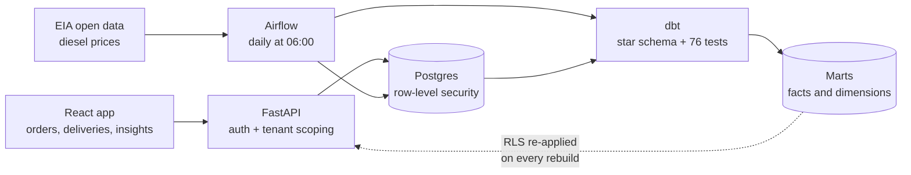
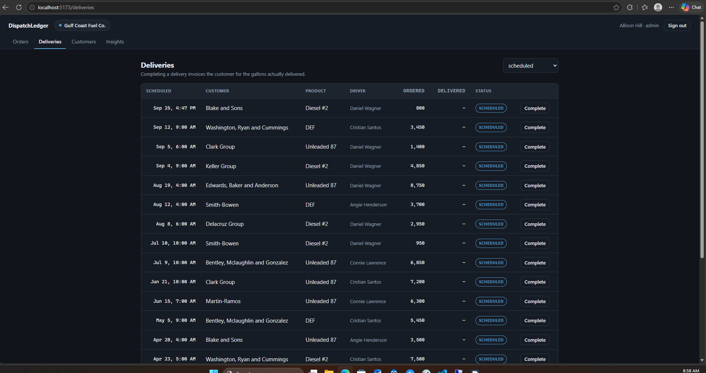
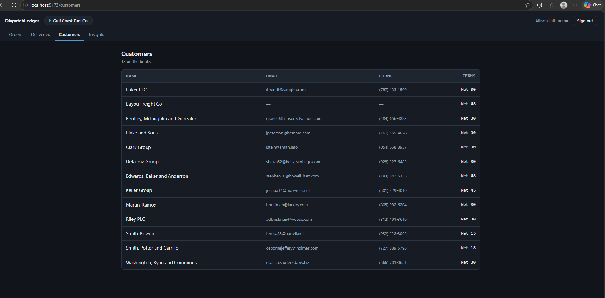

# DispatchLedger

[](https://github.com/Pogbebs/dispatchledger/actions/workflows/ci.yml)

A multi-tenant operations platform for fuel and bulk-liquid distributors — customers, delivery sites, orders, deliveries and invoicing — with every company's data isolated inside the database itself, and a nightly pipeline turning the operational record into a tested warehouse.

Built to answer the question that defines multi-tenant SaaS: **how do you guarantee one customer can never see another's data?** The answer here is Postgres row-level security rather than a `WHERE` clause developers have to remember.


---

## What's in it



| Layer | What it does |
|---|---|
| **Database** | 8 tables, every schema change an Alembic migration, tenant isolation enforced by RLS policies |
| **API** | FastAPI with JWT auth, per-request tenant scoping, role-based access, 35 tests |
| **Web** | React + TypeScript: orders board, delivery completion, customer list, pricing insights |
| **Warehouse** | dbt star schema — 6 dimensions, 3 facts, 1 aggregate, 76 data tests |
| **Pipeline** | Airflow DAG ingesting live EIA fuel prices, rebuilding and testing the warehouse nightly |

The dotted line is the part worth reading the code for: the application reads
one warehouse table directly, under the same row-level security as everything
else, without ever holding the analytics credential.

## The core idea: isolation the application cannot forget

The usual approach filters by tenant in application code:

```python
session.query(Order).filter(Order.tenant_id == current_user.tenant_id)
```

One forgotten filter in one endpoint leaks another company's data. The filter is a convention, and conventions fail.

Here the rule lives in Postgres. Every tenant-scoped table carries a policy:

```sql
CREATE POLICY tenant_isolation ON orders
    USING (tenant_id = NULLIF(current_setting('app.current_tenant', true), '')::uuid);
```

The API sets `app.current_tenant` once per request from the authenticated user's token. From then on, a bare `SELECT * FROM orders` returns only that tenant's rows. There is nothing to forget.

Three details make it hold up:

- **It fails closed.** `current_setting(..., true)` returns `NULL` when the tenant is unset, and `NULL = anything` is `NULL`. A request that never sets the tenant sees **zero** rows, not every row.
- **The app role is not a superuser.** Postgres lets superusers bypass row-level security entirely, so the API connects as `dispatch_app`, a plain login role that owns nothing. Testing isolation as the owner would pass while proving nothing.
- **Writes are checked too.** `WITH CHECK` on each policy means a tenant cannot insert a row belonging to someone else, not just fail to read one.

### Proving it, not claiming it

`check_isolation.py` connects as the application role and asserts the guarantee end to end:

```
Tenant isolation: Gulf Coast Fuel Co. vs Lone Star Bulk Supply

  [PASS] unset tenant sees no rows              saw 0 customers with no tenant set
  [PASS] each tenant sees a slice               Gulf Coast Fuel Co.: 13, Lone Star Bulk Supply: 12
  [PASS] slices sum to the full table           13 + 12 == 25
  [PASS] cross-tenant query returns nothing     asking for Lone Star Bulk Supply's rows while scoped to Gulf Coast Fuel Co. returned 0
  [PASS] orders expose one tenant only          orders visible from 1 tenant(s)
  [PASS] cannot write into another tenant       insert rejected by the row-security policy
  [PASS] warehouse mart is tenant-scoped        weekly rows visible from 1 tenant(s)
  [PASS] mart slices sum to the whole           25 + 26 == 51 weekly rows

8/8 checks passed.
```

The last two are the ones most likely to catch a real regression. Every table
above them is created once by a migration and keeps its policy forever. The
mart is dropped and rebuilt by dbt every night, so its policy exists only
because a post-hook re-creates it.

## The API

Tenant scoping happens once, in a request dependency, from the authenticated user's token:

```python
with tenant_session(user.tenant_id) as session:
    yield session
```

Handlers then query with no tenant filter at all:

```python
stmt = select(Customer).order_by(Customer.name)
return list(session.scalars(stmt))
```

`tenant_session` sets `app.current_tenant` with `SET LOCAL`, binding it to the transaction so it cannot survive on a pooled connection into the next request. A test alternates between two tenants thirty times to confirm it.

The tenant travels in the signed token, so there is no tenant parameter anywhere in the API for a client to tamper with. Requesting another tenant's record by its real id returns **404** — the policy hid the row, so the handler genuinely cannot tell it apart from one that does not exist.

Interactive docs at `/docs`. Demo credentials after seeding: tenant `gulf-coast`, user `admin@gulf-coast.example.com`, password `demo1234`. Sign in as `driver1@` instead to see the same screens with fewer permissions.

### The screens

Completing a delivery records what actually arrived, then invoices for that amount rather than for what was ordered. Trucks routinely deliver short, so the two quantities are stored separately — and the gap between them is where fill rate comes from.



Customers carry the payment terms that set each invoice's due date, which is what drives the receivables ageing in the warehouse.



## The warehouse

dbt models the operational tables into a star schema, read by a third role:

**`dispatch_analytics` carries `BYPASSRLS`** — the deliberate exception. Analytics has to read across every tenant, which is exactly what the application role must never do, so the exception gets its own auditable credential rather than being smuggled through the app's.

That trade has a cost: with RLS bypassed, nothing at the database level stops a careless join from stitching one tenant's delivery to another tenant's customer. `assert_no_cross_tenant_rows.sql` is the replacement for the protection given up.

Two measures exist only because of a schema decision made on day one. Ordered and delivered quantities are separate columns, so `fct_deliveries` can compute **shortfall** and **fill rate** — the number an operations team actually manages. A system that overwrote ordered with delivered could compute neither.

Six of the 76 tests name a specific failure rather than checking a shape:

| Test | What it catches |
|---|---|
| `assert_every_invoice_has_a_completed_delivery` | Billing for fuel that never arrived |
| `assert_invoice_amount_matches_delivery` | Warehouse revenue diverging from what the app billed |
| `assert_no_cross_tenant_rows` | A join crossing the tenant boundary |
| `assert_benchmark_totals_reconcile` | A model silently filtering rows out of a margin report |
| `assert_fill_rate_is_plausible` | Impossible deliveries distorting every average downstream |
| `assert_weekly_position_reconciles` | A rollup drifting from the detail the user can check it against |

## Letting the app read the warehouse

The Insights screen draws one dbt model, `agg_weekly_price_position` — weekly
realised price against the national benchmark. Getting a warehouse table onto
an application screen is where the isolation guarantee usually quietly dies,
because the obvious route is to hand the API the analytics credential.

This does the opposite. The mart carries its own policy, applied as a dbt
post-hook, and the API reads it as `dispatch_app` exactly like every other
table:

```sql
{{ config(post_hook=[
    "grant usage on schema {{ this.schema }} to dispatch_app",
    "grant select on {{ this }} to dispatch_app",
    "alter table {{ this }} enable row level security",
    "create policy tenant_isolation on {{ this }} using (...)",
]) }}
```

The post-hook is not decoration. A table-materialized model is **dropped and
recreated** on every run, and a policy is a property of the table, not of the
data in it — so it dies with the old table. Attach it once by hand and
isolation disappears the first night the pipeline runs, silently, with every
test still green. That is what the two new checks in `check_isolation.py`
exist to catch.

`ENABLE` rather than `FORCE` is also deliberate: owners are exempt from their
own policies unless forced, and dbt's tests run as the owner and need to see
every tenant to verify the rollup reconciles.

Both price series on that screen are volume-weighted in the warehouse rather
than averaged per delivery. A 20,000 gallon load and a 200 gallon top-up are
one row each, so an unweighted average would let the small delivery move the
weekly figure as much as the large one — and the gap between the two lines,
which is the entire point of the chart, would be visually persuasive and
arithmetically meaningless.

## The pipeline

An Airflow DAG runs daily at 06:00 UTC:

```
fetch_fuel_prices → load_fuel_prices → dbt_build → check_source_freshness
```

Each step encodes a decision:

- **The price fetch skips rather than fails** without an API key, and `dbt_build` uses `trigger_rule="none_failed"` so the warehouse still rebuilds. An optional enrichment should not fail a run — that is how alerting becomes noise people ignore.
- **The loader upserts** on `(series_id, price_date)`. EIA revises recent weeks, and a retry must not double rows. That is what makes the task idempotent and safe for Airflow to retry.
- **It runs `dbt build`, not `run` then `test`** — build interleaves each model with its tests and stops a branch when they fail, rather than building everything downstream of bad data first.
- **dbt lives in its own virtualenv** inside the Airflow image. The two pin incompatible versions of `click`; installing them together yields an environment that imports fine and misbehaves subtly.

`fct_price_benchmark` prices each diesel delivery against the national retail benchmark published that week or earlier — an as-of join, because an equality join would match almost nothing and taking the nearest week either way would price a past sale against a market that did not exist yet.

Non-diesel deliveries are kept with a null market price rather than dropped. Gasoline and DEF move on different markets, and a margin report over a silently filtered subset is the classic way these models lie.

## Data model decisions

| Decision | Why |
|---|---|
| `orders.unit_price` snapshots the price at order time | Fuel prices move daily. Pointing invoices at `products.current_price` would silently rewrite last month's billing. |
| Ordered and delivered quantities are separate columns | Trucks routinely deliver short. Invoices bill what arrived, and the gap is a real metric: fill rate. |
| Money is `NUMERIC(12,2)`, never a float | Floating point loses cents. Values stay strings all the way to the browser so display code cannot reintroduce it. |
| Statuses are constrained with `CHECK` | Keeps invalid states out of the database rather than out of the code that writes to it. |
| `users.email` is unique per tenant, not globally | The same person may work for two distributors that both use the platform. |
| UUID primary keys | Sequential integers leak volume and invite enumeration across tenant boundaries. |


## Testing

| Suite | Count | What it covers |
|---|---|---|
| `check_isolation.py` | 8 | Tenant isolation at the database level, as the app role — including a dbt-rebuilt mart |
| `pytest` | 35 | Auth, roles, business rules, cross-tenant 404s, connection-pool leakage |
| `dbt test` | 76 | Schema constraints, referential integrity, and six named data defects |

All three run in CI against a real Postgres, along with a TypeScript build and a DAG import check.

## Running it

Requires Docker, [uv](https://docs.astral.sh/uv/) and Node 20+.

```bash
# 1. Start Postgres
docker run --name dispatch-db \
  -e POSTGRES_USER=dispatch -e POSTGRES_PASSWORD=dispatch -e POSTGRES_DB=dispatchledger \
  -p 5433:5432 -d postgres:16

# 2. Install dependencies
uv sync

# 3. Build the schema, roles and row-level security policies
uv run alembic upgrade head

# 4. Load two tenants of six months of trading
#    Seeds against whatever EIA prices are already loaded, so running the
#    pipeline first gives demo data priced at a believable spread over the
#    real market. Without it, fixed list prices are used instead.
uv run python seed.py

# 5. Verify tenant isolation
uv run python check_isolation.py

# 6. Run the API tests
uv run pytest -q

# 7. Start the API (docs at http://localhost:8000/docs)
uv run uvicorn dispatchledger.main:app --reload
```

The web app, in a second terminal:

```bash
cd web && npm install && npm run dev     # http://localhost:5173
```

The warehouse:

```bash
cd analytics
export DBT_PROFILES_DIR=$PWD
uv run dbt build                         # 20 models, 76 tests
```

The pipeline:

```bash
cd pipelines
cp .env.example .env                     # add a free EIA key, or leave blank
docker compose up -d --build             # Airflow at http://localhost:8081
```

Without an EIA key the price fetch skips and everything else still runs. Get one at [eia.gov/opendata](https://www.eia.gov/opendata/register.php).

Sample data is 25 customers, 42 delivery sites, 444 orders, 413 deliveries and 367 invoices across six months and two tenants, generated with Faker under a fixed seed so runs are reproducible.

Order prices are derived from the EIA series rather than a constant, each order taking the market as it stood on its own requested date plus a per-tenant margin — Gulf Coast around 28¢ a gallon, Lone Star around 37¢. This started as a bug worth keeping in mind: the seed originally hard-coded diesel at $3.84, which was reasonable when written and badly wrong a year later against a market that had nearly doubled. Every test still passed, because every number in the warehouse remained internally consistent. Only comparing against the outside world showed it, which is the one thing a test suite cannot do for you.

## Stack

Python 3.14 · PostgreSQL 16 · SQLAlchemy 2.0 · Alembic · FastAPI · React 18 · TypeScript · Vite · dbt · Airflow 3 · Docker · uv

## Status

| | |
|---|---|
| Data model, row-level security, seed data, isolation checks | done |
| REST API — auth, per-request tenant scoping, role-based access | done |
| Web interface — orders board, delivery completion, customers | done |
| Insights — warehouse-backed pricing screen, RLS preserved across rebuilds | done |
| Warehouse — dbt star schema with 76 data tests | done |
| Pipeline — Airflow, live EIA price ingest, nightly rebuild | done |
| CI — tests, warehouse, type-check and DAG parse on every push | done |
| Cloud deployment | planned |

---

Built by [Praise Ogbebor](https://github.com/Pogbebs).
